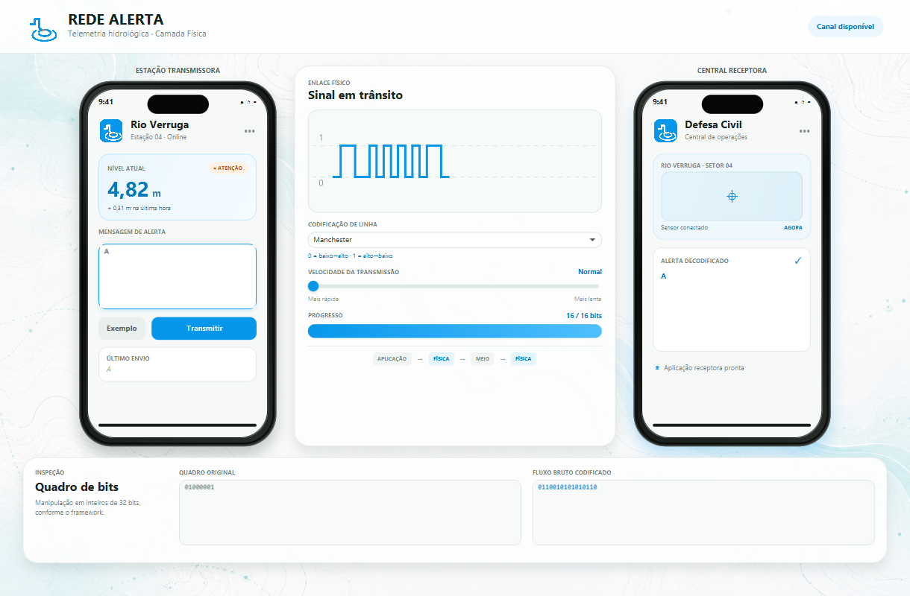

# Rede Alerta - Simulador da Camada Física



Trabalho prático de Redes de Computadores I que simula o envio de alertas entre
uma estação hidrológica e a Central da Defesa Civil. O projeto implementa as
camadas de aplicação e física e transmite cada nível lógico pelo meio de
comunicação simulado.

## Protocolos implementados

- **Binária (NRZ-L):** `0` é nível baixo e `1` é nível alto.
- **Manchester:** `0` é representado por `01` e `1` por `10`.
- **Manchester Diferencial:** sempre existe uma transição no meio do bit; o bit
  `0` também causa transição no início. O nível inicial adotado é alto.

A convenção escolhida é exibida na interface para que codificador, decodificador
e apresentação utilizem exatamente a mesma definição.

## Fluxo da simulação

```text
Aplicação Transmissora
        ↓
Camada de Aplicação Transmissora (String → quadro de bits)
        ↓
Camada Física Transmissora (codificação de linha)
        ↓
Meio de Comunicação (transferência bit a bit)
        ↓
Camada Física Receptora (decodificação de linha)
        ↓
Camada de Aplicação Receptora (quadro de bits → String)
        ↓
Aplicação Receptora
```

O quadro é um vetor `int[]` e segue diretamente a montagem bit a bit definida
no framework fornecido pelo professor, sem inclusão de cabeçalhos ou protocolos
adicionais.

## Interface

A interface clara, inspirada no acabamento visual do iOS, apresenta dois
aparelhos completos para representar transmissor e receptor. O fundo autoral
combina curvas topográficas, fluxo de água e pontos de telemetria. A tela também
apresenta:

- estação transmissora e Central da Defesa Civil;
- seleção da codificação por menu;
- controle da velocidade da simulação;
- forma de onda dos últimos níveis transmitidos;
- progresso bit a bit;
- quadro original e fluxo bruto codificado;
- mensagem recuperada pela aplicação receptora.

## Estrutura

```text
camada-fisica/
├── Principal.java
├── control/
│   └── ControllerPrincipal.java
├── model/
│   ├── AplicacaoTransmissora.java
│   ├── CamadaAplicacaoTransmissora.java
│   ├── CamadaFisicaTransmissora.java
│   ├── MeioDeComunicacao.java
│   ├── CamadaFisicaReceptora.java
│   ├── CamadaAplicacaoReceptora.java
│   └── AplicacaoReceptora.java
├── view/
│   ├── view_principal.fxml
│   └── Style.css
```

Todos os nomes das classes, métodos e variáveis do projeto estão em português,
conforme solicitado no enunciado.

## Requisitos

- Java 8 com JavaFX 8 disponível. O Oracle JDK 8 tradicional já inclui JavaFX;
- em distribuições OpenJDK 8 que não incluem JavaFX, é necessário instalar o
  OpenJFX 8 correspondente.

## Compilar e executar no Java 8

Na raiz do projeto, o professor pode utilizar diretamente:

```text
javac Principal.java
java Principal
```

`Principal.java` mantém uma referência de compilação ao controller. Dessa
forma, o primeiro comando também encontra e compila automaticamente as classes
de `control` e `model`, embora o controller seja carregado em tempo de execução
pelo FXML.

## Execução alternativa no ambiente de desenvolvimento

No PowerShell, dentro da pasta do projeto:

```powershell
.\executar.ps1
```

O script encontra automaticamente a versão mais recente do JavaFX instalada no
repositório Maven local, compila os fontes para a pasta `out` e abre a aplicação.
